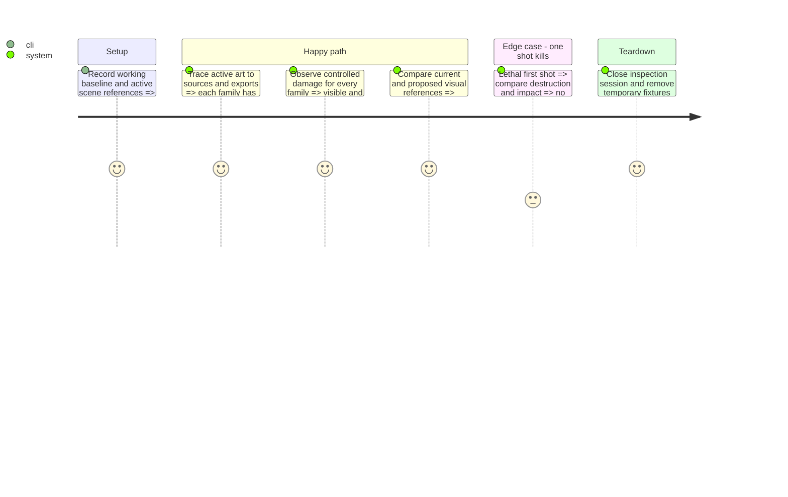

# Instruction: Confirm the active asset inventory and visual contract

## Architecture projection

```txt
aidd_docs/tasks/2026_09/2026_09_20_sprite_hits_background/
  checkup.md                                      ✏️ append reproduced runtime findings
  visual_contract.md                              ✅ active asset matrix and accepted targets
assets/art/sprite_references/sprite_hits_background/
  baseline.png                                    ✅ native-size comparison with clear labels
```

No deletions. Runtime and source art remain read-only in this phase.

## Test Scope



## Tasks to do

### `1)` Complete the active replacement matrix

> Distinguish available assets, synchronized exports and actually used scenes.

1. Start from checkup.md; trace player/team variants, weapons, shield, pickups, enemies, hazards and backgrounds, including dynamic paths.
2. Record source, runtime export, frame layout, source tag ranges, scene indices, native footprint, palette result and integration status for each retained family.
3. Confirm carrier/interceptor discrepancies through Aseprite source renders against PNGs. Do not overwrite exports from an older source. Mark unrelated findings as follow-up scope.

### `2)` Reproduce and define a common hit treatment

> Ground the visual fix in rendered evidence.

1. Observe the seven families with survivable health, all three/four asteroid variants, mounted turrets and real elite configuration; cover single shots, rapid hits, beam and lethal damage.
2. Record native-scale before/hit/return evidence. Separate missing dispatch, wrong pose, stale source and low contrast; do not assert a root cause without the reproducing case.
3. Propose a shared brief light-colored impact, localized material highlights and clean return, keeping each silhouette and elite markings identifiable. Start from the existing 120 ms envelope and avoid double brightening from authored hit pixels plus shader.
4. Specify the intended 32 × 64 native Grave Carrier hull and separate runtime turrets. Following maintainer scale feedback after completion, propose explicit hull/turret collision and anchor alignment for phase 2 instead of preserving the incorrect 16 × 32 assembly.

### `3)` Fix the background production contract

> Make a bounded art decision for the actual viewport.

1. Use the maintainer's preference if supplied; otherwise mark dark industrial space and peripheral debris as provisional. Reference existing accepted material, not a new universe.
2. Define one 640 × 450 editable master and three full-canvas transparent exports: far stars, distant atmosphere/objects, and restrained near debris/stars. Recompose at native scale; do not shrink the entire 1600 × 1200 environment into a noisy miniature.
3. Use Lost Warden 64 RGB, controlled alpha, dark central combat space, and no bright object resembling a hostile shot. Keep background under the current HUD without changing layout.
4. Capture current baseline, document the proposed composition and measurable constraints in visual_contract.md, and record remaining aesthetic decisions for review before production.

## Test acceptance criteria

| Task | Acceptance criteria |
| --- | --- |
| 1 | Verified: every active family is mapped to actual runtime references in `visual_contract.md`; historical docs and unused libraries are explicitly distinguished. |
| 2 | Verified: 18 rendered cases show working dispatch and weak assembled-carrier feedback; `baseline.png` provides native evidence and the contract links concrete carrier/material references. |
| 3 | Verified: the contract specifies native dimensions, three layers, palette, central readability and the proposed background direction; final color preference remains explicitly open. |
