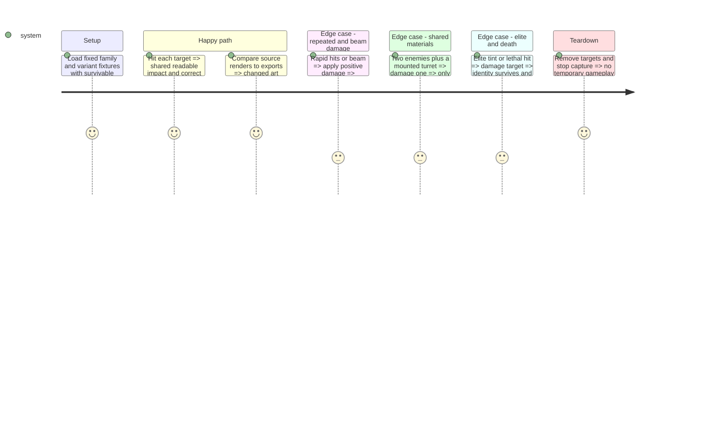

# Instruction: Harmonize active enemy art and hit feedback

## Architecture projection

```txt
assets/sources/enemies/
  drone.ase, tie_sheet.ase, interceptor.ase, turret.ase       ✏️ synchronized material and hit treatment
  asteroid_sheet.ase, big_asteroid.ase                       ✏️ all selected hazard hit variants
  grave_carrier_native.aseprite                             ✅ 32 × 64 native carrier adaptation
assets/sprites/enemies/
  drone.png, tie_sheet.png, interceptor.png, turret.png       ✏️ matching runtime exports
  asteroid_sheet.png, big_asteroid_sheet.png                 ✏️ matching hazard exports
  grave_carrier_native.png                                  ✅ synchronized carrier atlas
scenes/enemies/
  enemy.gd                                                  ✏️ shared hit lifecycle only where reproduced evidence requires
  drone.tscn, tie.tscn, interceptor.tscn, turret.tscn          ✏️ explicit pose/timing mapping
  mother_ship.tscn, asteroid.tscn, big_asteroid.tscn           ✏️ carrier texture, assembly geometry and hit mappings
  mother_ship_turret.tscn                                    ✏️ dedicated carrier turret art and geometry alignment
scenes/effects/
  enemy_hit_flash.gdshader, enemy_hit_flash.tres              ✏️ shared visual response if tuning is needed
tests/test_enemy_feedback.gd                                 ✏️ actual variants and transition coverage
```

Carrier scale amendment after phase-1 review: the maintainer identified the current carrier as incorrectly sized. Use the prepared 32 × 64 hull at scale one; explicitly align its collision, turret artwork/anchors and shot origins. Inspect `mother_ship_turret.tscn` for a corresponding bounded assembly correction; preserve damage and cadence. This is planned work, not an implemented geometry change.

No deletions. Only change already-consistent art when required by the phase-1 contract; avoid resaving unrelated frames. Mounted turret behavior inherits the turret scene and must be tested without duplicating its implementation. Preserve existing elite runtime presentation; do not activate the entire prepared elite/action library.

## Test Scope



## Tasks to do

### `1)` Synchronize and harmonize enemy assets

> Use Aseprite to correct the actual active assets.

1. Reconcile interceptor provenance and frame count before export. Work from preserved copies; verify unchanged idle/destruction frames unless the approved contract requires a specific correction.
2. Apply the common material/impact treatment across active enemy and asteroid variants, respecting Lost Warden 64 and native footprints.
3. Use the carrier at its intended native 32 × 64 size with explicit idle/hit/explode tags. Separate the authored turret components from the hull; avoid overlaying full-size standalone turret ships. Align hull/turret collision shapes and muzzle/mount anchors to the resulting assembly while preserving independent targetability.
4. Export without trimming or unintended padding; verify frame bounds, dimensions, visible palette and source/export pixel agreement.

### `2)` Connect the shared feedback consistently

> Fix observed visual gaps without changing combat behavior.

1. Map hit and return frames explicitly in every affected scene. Preserve current node names, orientations, scale exceptions and physics geometry outside the explicitly planned carrier assembly correction.
2. Reuse shared per-instance shader/tween feedback. Tune authored impact and flash together; preserve tint and alpha. Keep beam damage visually acknowledged without adding recoil or mandatory hit-animation interruption.
3. Ensure repeated hits restart feedback, destruction wins over hit return, and feedback does not leak between instances or into a stuck flash. Retain deferred collision shutdown.

### `3)` Verify all actual variants

> Check the rendering and lifecycle beyond shader parameter values.

1. Extend existing enemy feedback tests for deterministic asteroid variants, mounted turrets, configured elites, repeated and lethal transitions. Keep existing assertions on damage delivery and beam recoil.
2. Run existing native-scale and collision-alignment checks, compare source/export renders, then capture native-scale reactions over the current background.
3. Confirm actual damage/cadence are unchanged and carrier shot origins align with the corrected artwork. Record remaining visual limitations rather than accepting a headless pass as visual proof.

## Test acceptance criteria

| Task | Acceptance criteria |
| --- | --- |
| 1 | Active enemy/hazard art shares the agreed style; carrier is no longer the legacy hull; changed runtime exports match their editable sources. |
| 2 | Every active variant visibly acknowledges survivable hits, returns correctly, preserves elite identity and completes death without stale hit state. |
| 2 | Beam adds no recoil; damage, movement, attack cadence, collision geometry outside the carrier assembly and mounted turret functionality match baseline. |
| 3 | Numeric regression checks and rendered evidence cover all seven families, all asteroid alternatives, mounted turrets and current elite presentation. |
