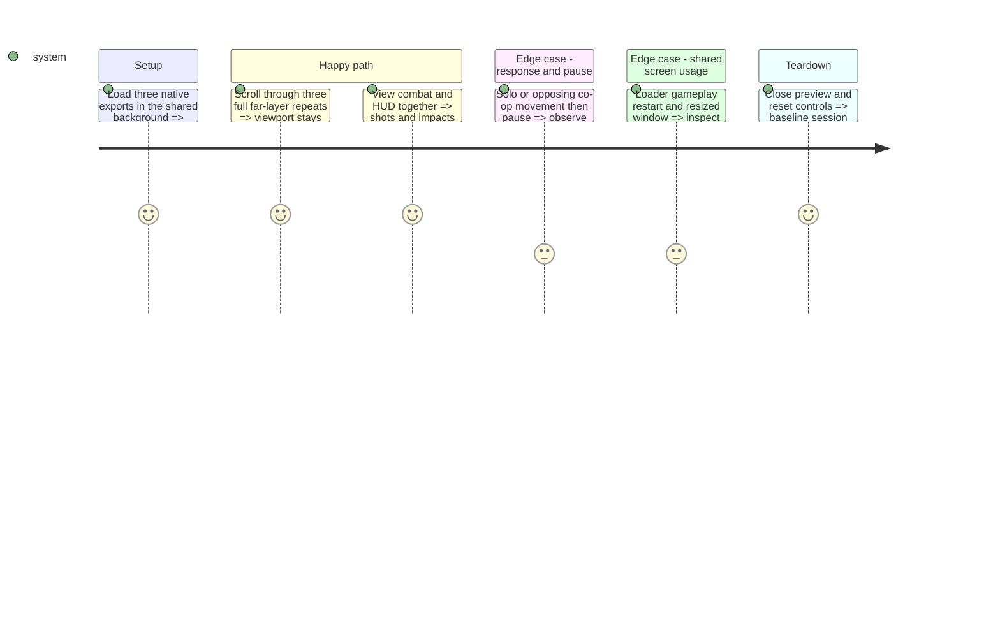

# Instruction: Produce and integrate the native background

## Architecture projection

```txt
assets/sources/world/gameplay_background.aseprite       ✅ editable native three-layer master
assets/sprites/world/gameplay_background/
  far.png, mid.png, near.png                           ✅ three full-canvas exports
scenes/world/background.tscn                           ✏️ connect textures and matching repeats
tests/test_background.gd                               ✅ coverage, repeat and speed regression checks
tests/test_native_scale.gd                             ✏️ validate active background contract instead of old filenames
```

No deletions. Keep original sources and historical variants. Keep `background.gd` speed response unchanged; no new parallax framework or automatic theme switching. Godot-generated import sidecars accompany the new PNGs.

## Test Scope



## Tasks to do

### `1)` Produce one coherent native environment

> Reuse approved visual material through deliberate native composition.

1. Build the phase-1 composition in Aseprite at 640 × 450, adapting existing industrial material and using three independently editable layers.
2. Keep the playable center quiet, distant matter subdued and debris sparse. Check combined brightness behind HUD and enemy hit frames, including peripheral action.
3. Prepare continuous vertical repeats; verify horizontal edges as required by the existing mirrored scene and camera offsets. Avoid a uniformly empty stripe at every seam.
4. Export each layer at full size with source/export pixel equality. Audit visible RGB against Lost Warden 64; retain intentional alpha and inspect compositing over the actual game background.

### `2)` Integrate with existing parallax

> Make the replacement work in both current instances.

1. Map far/mid/near art to existing b3/b2/b1 nodes. Keep motion ratios 0.5/0.8/1.1 and current player-motion response; use repeat distances matching 640 × 450 exports.
2. Keep nearest filtering and Sprite2D scale one. Set offsets and layer modulation deliberately so brightness is not accidentally attenuated twice by authored alpha and historical scene tints.
3. Verify loader and gameplay instances plus existing main-menu star particles. Do not change menu layout or add new decorative systems.

### `3)` Verify coverage and readability

> Validate actual scrolling rather than only matching boundary rows.

1. Add a focused scene test for active texture size, matching repeats, native scale, existing speed response and co-op intent averaging. Update the existing scale check to inspect the active assets.
2. Inspect at least three complete far-layer cycles at maximum existing speed; at ratio 0.5, speed 50 and height 450 this is at least 54 seconds. Include the initial ramp from scene speed 0.
3. Exercise pause/resume, restart, resized windows and full camera shake. Capture a dense wave with player shots, beams, both players and enemy impacts; reject seams, holes and shot-like bright decorations.

## Test acceptance criteria

| Task | Acceptance criteria |
| --- | --- |
| 1 | One coherent environment matches the agreed direction and current palette; editable layers reproduce all three exports. |
| 2 | Background fills the current viewport at scale one and preserves existing parallax ordering, speed response and shared-scene loading. |
| 3 | Three full far-layer repeats show no visible discontinuity or uncovered area; combat and HUD remain readable in solo and co-op. |

## Completion evidence

- The existing Frozen Graveyard material was recomposed from its editable source into the native 640 × 450 `far`, `mid` and `near` layers. The active exports match those source layers exactly.
- `background.tscn` maps the layers to b3/b2/b1, keeps the existing 0.5/0.8/1.1 motion ratios and uses matching 640 × 450 repeat distances without inherited dimming.
- `test_background.gd` verifies native texture dimensions, ordering, repeat distances, motion ramp, co-op intent averaging and three far-layer cycles at maximum speed. `test_native_scale.gd`, `test_enemy_feedback.gd` and a main-scene smoke run also pass.
