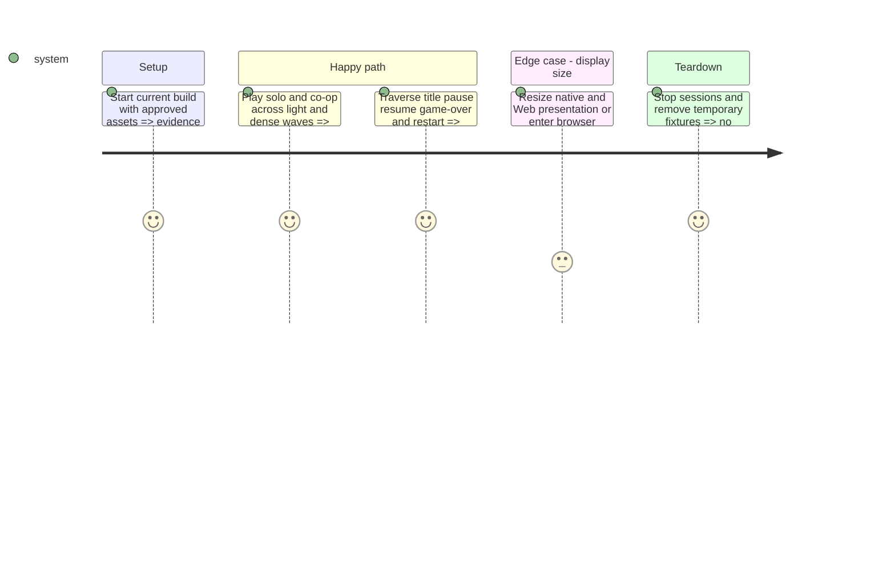

# Instruction: Verify the combined result and reconcile documentation

## Architecture projection

```txt
docs/
  graphics_replacement_readiness.md               ✏️ current integration status and remaining gaps
  sprite_production_inventory.md                  ✏️ actual source and export mappings
  background_variants.md                         ✏️ distinguish active native art from retained variants
  display_layout.md                              ✏️ current viewport and background facts
aidd_docs/tasks/2026_09/2026_09_20_sprite_hits_background/
  validation.md                                  ✅ evidence matrix and residual limitations
assets/art/sprite_references/sprite_hits_background/
  integrated_solo.png, integrated_coop.png         ✅ representative native gameplay captures
```

No deletions. Fix any discovered regression in the owning earlier phase before marking this phase complete. Do not update roadmap approvals or claim global sprite replacement is finished while unrelated active legacy assets remain.

## Test Scope



## Tasks to do

### `1)` Run the integrated verification

> Establish observable coverage for the actual complaint and combined art.

1. Run enemy feedback, background, native-scale and collision-alignment tests. Run the palette audit with changed-asset results separated from known historical failures.
2. Review solo/co-op waves 1–3, 6, 9, 12, 15 and 18 using existing debug controls where available. Cover all active families, mounted turrets, elite tint, rapid hits, beam contact and lethal damage.
3. Inspect title/loader, pause/resume, restart and game-over. Verify resized native presentation and a local Web build/fullscreen when export tooling is available. Record an unavailable platform check as unverified, never passed; do not publish a build.
4. Save representative native-resolution captures and a validation matrix with actual test results, visual observations and unresolved limitations. Numeric tests cannot approve aesthetics on their own.

### `2)` Reconcile documentation with the shipped scope

> Leave a reliable map for the next requested phase.

1. Update active source/export mappings, hit contracts and the background repeat/dimension contract.
2. Correct stale viewport and integration statements while preserving the provenance of historical variant libraries. List retained unrelated replacement gaps explicitly.
3. Check final changes contain no accidental `.tres` value stripping, generated cache files, geometry/balance changes, unrelated art rewrites or modifications to pre-existing staged work outside this scope.

## Test acceptance criteria

| Task | Acceptance criteria |
| --- | --- |
| 1 | Evidence covers the reported inconsistency, each active variant and the combined background in solo/co-op; all required local checks pass or have explicit unresolved blockers. |
| 1 | No visible stuck flash, incorrect return frame, background seam, unreadable shot or unintended size change remains in observed scenarios. |
| 2 | Documentation reflects actual active assets, dimensions and remaining scope; roadmap approvals are not inferred from this visual pass. |
